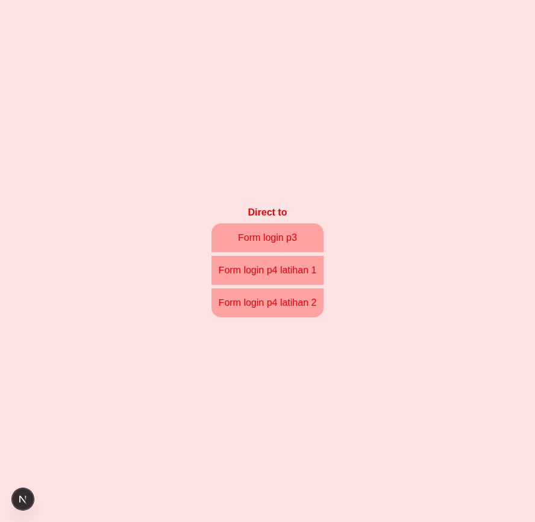
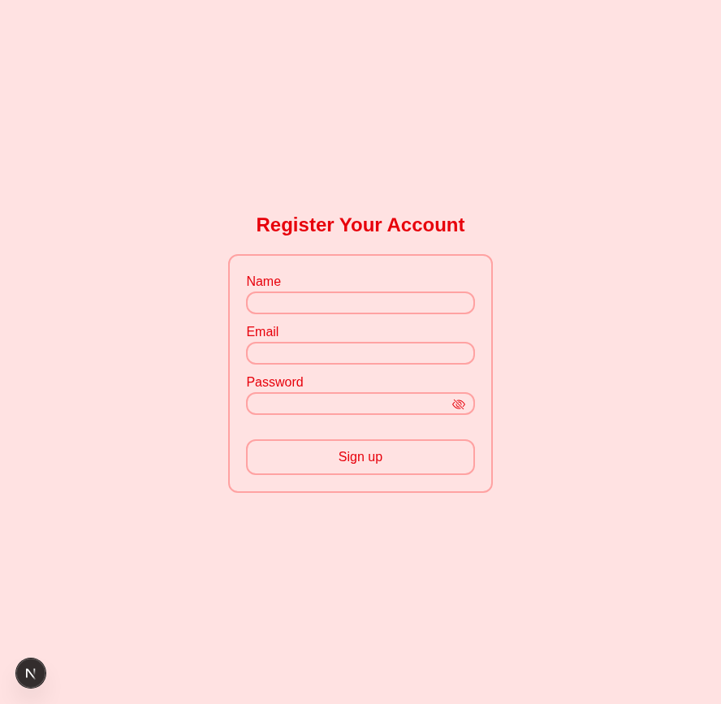
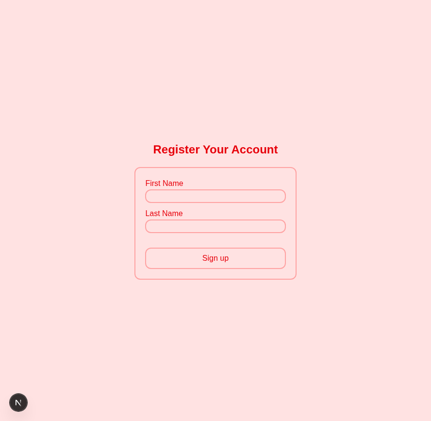
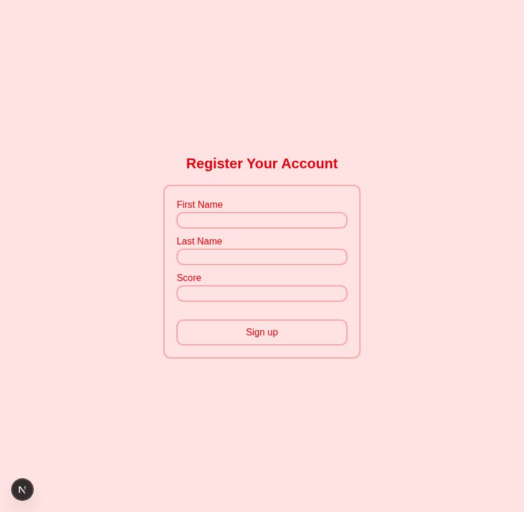
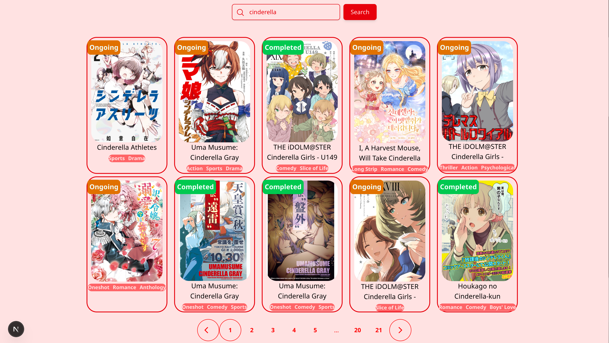

# Frontend Assignment

This project contains the frontend implementation for a university assignment with multiple form pages accessible via a landing page.

## Running the Application

To run this application:

1. Navigate to the app directory:
   ```bash
   cd sm3/my-app
   ```

2. Install dependencies:
   ```bash
   npm install
   ```

3. Start the development server:
   ```bash
   npm run dev
   ```

4. Then use this Localhost:
    ```bash
    http://localhost:3000
    ```


  

The application will be available at the URL provided in the terminal output.

## Application Structure

The application features a landing page with 3 buttons that direct users to different form pages:

- **Form P3** - Accessible via the `/form-p3` path
- **Form P4/1** - Accessible via the `/form-p4/1` path  
- **Form P4/2** - Accessible via the `/form-p4/2` path
- **Layout P5** - Accessible via the `/layouting` path

These forms were created as part of a university assignment and demonstrate various frontend concepts and functionality.

## Project Structure

```
sm3/my-app/
├── components/
│   └── registerForms.jsx
├── public/
├── src/
├── package.json
├── next.config.mjs
└── README.md
```

## Screenshots

Here are some screenshots of the application:

### Landing Page


### Form P3


### Form P4/1


### Form P4/2


### Flexbox Layouting P5
